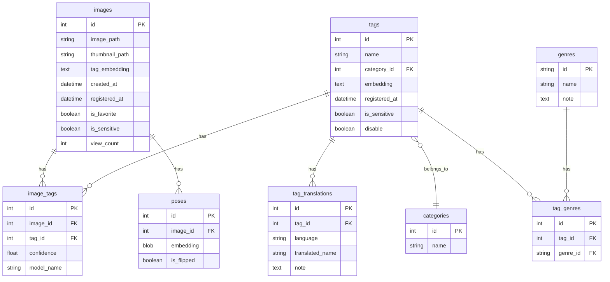

# Eagle App

**画像管理・タグ検索アプリケーション**

画像にタグを付けて整理・検索できる Web アプリケーションです。AI タグの管理、フォルダ整理、類似画像検索などの機能を提供します。

---

## 目次

- [概要](#概要)
- [主な機能](#主な機能)
- [技術スタック](#技術スタック)
- [プロジェクト構成](#プロジェクト構成)
- [セットアップ](#セットアップ)
- [起動方法](#起動方法)
- [API エンドポイント](#api-エンドポイント)
- [データベース構造](#データベース構造)
- [開発](#開発)

---

## 概要

Eagle App は、大量の画像を効率的に管理・検索するための Web アプリケーションです。AI で生成されたタグを活用して、画像の検索や分類を簡単に行えます。

### 主なユースケース

- AI イラスト・画像の管理
- タグベースの画像検索
- 類似画像の発見
- フォルダによる画像の整理
- センシティブコンテンツの管理

---

## 主な機能

### 🖼️ 画像管理

- **サムネイル一覧表示**: グリッドビューで画像を快適に閲覧
- **レイジーローディング**: スクロールに応じて画像を遅延読み込み
- **お気に入り登録**: 重要な画像をマーク
- **閲覧回数トラッキング**: 画像のアクセス数を記録
- **センシティブコンテンツフィルタ**: センシティブな画像の表示/非表示を切り替え

### 🏷️ タグ機能

- **タグ一覧・検索**: すべてのタグを表示・検索
- **タグフィルタリング**: 特定のタグで画像を絞り込み
- **多言語翻訳**: タグの翻訳を管理
- **カテゴリ分類**: タグをカテゴリで整理
- **ジャンル管理**: タグにジャンルを割り当て
- **タグの無効化**: 不要なタグを非表示化

### 📁 フォルダ機能

- **フォルダ作成**: 画像をグループ化
- **画像の追加/削除**: ドラッグ&ドロップで整理
- **フォルダ内画像の並び替え**: 順序をカスタマイズ
- **フォルダ一覧の展開/折りたたみ**: 多数のフォルダを効率的に表示
- **フォルダ名変更**: 後から名前を変更可能

### 🔍 高度な検索

- **類似画像検索**: タグの埋め込みベクトルを使用したコサイン類似度検索
- **複合フィルタ**: お気に入り、センシティブ、タグ、フォルダの組み合わせ
- **フォルダ外画像の表示**: フォルダに属さない画像のみを表示

### ⚙️ UI/UX

- **カラム数調整**: グリッドのカラム数を変更（2〜6 列）
- **アスペクト比切り替え**: 正方形/元の比率を選択
- **レスポンシブデザイン**: デスクトップ・タブレットに対応
- **PWA 対応**: Progressive Web App としてインストール可能

---

## 技術スタック

### フロントエンド

- **React 18.3** - UI フレームワーク
- **TypeScript 5.5** - 型安全な開発
- **Vite 5.4** - 高速ビルドツール
- **TailwindCSS 3.4** - ユーティリティファースト CSS
- **@tanstack/react-query 5.81** - データフェッチ・キャッシング
- **@dnd-kit** - ドラッグ&ドロップ機能
- **Axios** - HTTP クライアント
- **React Intersection Observer** - レイジーローディング
- **Heroicons** - アイコン
- **Vite PWA Plugin** - PWA サポート

### バックエンド

- **FastAPI** - 高速な Python Web フレームワーク
- **SQLAlchemy** - ORM（Object-Relational Mapping）
- **SQLite** - 軽量データベース
- **Uvicorn** - ASGI サーバー
- **Pydantic** - データバリデーション

### インフラ

- **nginx** - 静的ファイル配信・リバースプロキシ
  - サムネイル画像の静的配信
  - 1 年間のブラウザキャッシュ
  - GZIP 圧縮
  - ファイルキャッシュ最適化

---

## プロジェクト構成

```
eagle-app/
├── backend/               # バックエンド (FastAPI)
│   ├── app/
│   │   ├── main.py       # FastAPI アプリケーションエントリーポイント
│   │   ├── config.py     # 設定ファイル（パス、サムネイルサイズなど）
│   │   ├── routers/      # API エンドポイント
│   │   │   ├── images.py    # 画像関連 API
│   │   │   ├── folders.py   # フォルダ関連 API
│   │   │   └── tags.py      # タグ関連 API
│   │   ├── services/     # ビジネスロジック
│   │   │   ├── image_service.py
│   │   │   ├── folder_service.py
│   │   │   └── tag_service.py
│   │   ├── db/           # データベース層
│   │   │   ├── models.py    # SQLAlchemy モデル定義
│   │   │   ├── engine.py    # DB エンジン設定
│   │   │   ├── session.py   # セッション管理
│   │   │   └── queries/     # クエリ関数
│   │   │       ├── image.py
│   │   │       ├── folder.py
│   │   │       └── tag.py
│   │   ├── schemas/      # Pydantic スキーマ（リクエスト/レスポンス）
│   │   │   ├── image.py
│   │   │   ├── folder.py
│   │   │   └── tag.py
│   │   └── utils/        # ユーティリティ
│   │       ├── embedding.py    # ベクトル埋め込み処理
│   │       ├── image.py        # 画像処理
│   │       └── translations.py # 翻訳管理
│   └── thumbnails/       # サムネイル画像保存先
│
├── frontend/             # フロントエンド (React + TypeScript)
│   ├── src/
│   │   ├── main.tsx      # エントリーポイント
│   │   ├── App.tsx       # ルートコンポーネント
│   │   ├── config.ts     # API URL などの設定
│   │   ├── components/   # React コンポーネント
│   │   │   ├── ImageGallery.tsx    # メイン画像ギャラリー
│   │   │   ├── ImageModal.tsx      # 画像詳細モーダル
│   │   │   ├── FolderImageEditor.tsx
│   │   │   └── parts/              # 再利用可能なパーツ
│   │   │       ├── ThumbnailGrid.tsx
│   │   │       ├── FolderGrid.tsx
│   │   │       ├── LazyImage.tsx
│   │   │       └── Section.tsx
│   │   ├── contexts/     # React Context
│   │   │   └── AppContext.tsx
│   │   └── api/          # API クライアント
│   │       ├── images/
│   │       ├── folders/
│   │       └── tags/
│   ├── dist/             # ビルド成果物
│   ├── nginx.conf        # nginx 設定ファイル
│   └── package.json      # 依存関係管理
│
└── README.md             # このファイル
```

---

## セットアップ

### 前提条件

- **Python 3.10+**
- **Node.js 18+**
- **nginx** (Windows の場合は nginx for Windows)

### 1. バックエンドのセットアップ

```bash
cd backend

# 仮想環境の作成（推奨）
python -m venv venv
source venv/bin/activate  # Windows: venv\Scripts\activate

# 依存関係のインストール
pip install fastapi uvicorn sqlalchemy pydantic python-multipart

# 設定ファイルの編集
# app/config.py でパスを適切に設定
```

#### 設定ファイル (`backend/app/config.py`)

```python
IMAGE_DIR = Path("C:/path/to/your/images")      # 元画像ディレクトリ
THUMB_DIR = Path("C:/path/to/thumbnails")       # サムネイル保存先
DB_PATH = "C:/path/to/images.db"                # データベースファイル
THUMBNAIL_SIZE = (190, 190)                     # サムネイルサイズ
```

### 2. フロントエンドのセットアップ

```bash
cd frontend

# 依存関係のインストール
npm install

# 設定ファイルの編集
# src/config.ts でベースURLを設定
```

#### 設定ファイル (`frontend/src/config.ts`)

```typescript
const BASE_URL = "http://192.168.11.11"; // nginx のホスト
export const API_BASE_URL = `${BASE_URL}/api`;
export const STATIC_BASE_URL = `${BASE_URL}/static`;
```

### 3. nginx のセットアップ

#### nginx.conf の編集

`frontend/nginx.conf` を編集して、パスを環境に合わせて設定:

```nginx
# サムネイル画像の配信
location /static/thumbnails {
    alias C:/Users/your_username/path/to/thumbnails;
    expires 1y;
    add_header Cache-Control "public, immutable";
    access_log off;
    add_header Access-Control-Allow-Origin *;
}

# フロントエンド配信
location / {
    root C:/Users/your_username/path/to/frontend/dist;
    index index.html;
    try_files $uri /index.html;
}
```

#### nginx の起動（Windows）

```bash
# nginx ディレクトリに移動
cd C:/nginx

# 設定ファイルをコピー
copy C:/path/to/eagle-app/frontend/nginx.conf conf/nginx.conf

# nginx の起動
start nginx

# nginx の再起動
nginx -s reload

# nginx の停止
nginx -s stop
```

---

## 起動方法

### 開発環境

#### 1. バックエンドの起動

```bash
cd backend
python -m app.main
# または
uvicorn app.main:app --reload --host 127.0.0.1 --port 8000
```

API サーバーが `http://127.0.0.1:8000` で起動します。

#### 2. フロントエンドの起動（開発サーバー）

```bash
cd frontend
npm run dev
```

開発サーバーが `http://localhost:5173` で起動します（Vite）。

#### 3. nginx の起動

```bash
# nginx を起動（設定済みの場合）
nginx
```

nginx が `http://192.168.11.11` で起動します。

### 本番環境

#### 1. フロントエンドのビルド

```bash
cd frontend
npm run build
```

ビルド成果物が `frontend/dist/` に生成されます。

#### 2. バックエンドの起動

```bash
cd backend
uvicorn app.main:app --host 127.0.0.1 --port 8000
```

#### 3. nginx の起動

```bash
nginx
```

アプリケーションに `http://192.168.11.11` でアクセスできます。

---

## API エンドポイント

### 画像関連 (`/api/image`)

| メソッド | エンドポイント                 | 説明                                       |
| -------- | ------------------------------ | ------------------------------------------ |
| GET      | `/image/thumbnails`            | サムネイル一覧を取得（フィルタリング対応） |
| GET      | `/image/original?id={id}`      | オリジナル画像を Base64 で取得             |
| GET      | `/image/similar?image_id={id}` | 類似画像を検索                             |
| POST     | `/image/favorite`              | お気に入り状態をトグル                     |
| DELETE   | `/image/{image_id}`            | 画像を削除                                 |

#### クエリパラメータ (`/image/thumbnails`)

- `include_sensitive` (bool): センシティブ画像を含む
- `favorites_only` (bool): お気に入りのみ
- `selected_tag` (int): タグ ID で絞り込み
- `exclude_in_folder` (bool): フォルダ外の画像のみ
- `shuffle` (bool): ランダムにシャッフル

### フォルダ関連 (`/api/folders`)

| メソッド | エンドポイント                       | 説明                       |
| -------- | ------------------------------------ | -------------------------- |
| GET      | `/folders`                           | フォルダ一覧を取得         |
| GET      | `/folders/{folder_id}`               | 特定フォルダの詳細取得     |
| POST     | `/folders`                           | 新しいフォルダを作成       |
| PUT      | `/folders/{folder_id}/images`        | フォルダに画像を追加       |
| PUT      | `/folders/{folder_id}/images/remove` | フォルダから画像を削除     |
| PUT      | `/folders/{folder_id}/name`          | フォルダ名を変更           |
| PUT      | `/folders/{folder_id}/reorder`       | フォルダ内の画像順序を変更 |
| DELETE   | `/folders/{folder_id}`               | フォルダを削除             |

### タグ関連 (`/api/tags`)

| メソッド | エンドポイント   | 説明                                 |
| -------- | ---------------- | ------------------------------------ |
| GET      | `/tags`          | タグ一覧を取得（カテゴリ・翻訳含む） |
| PATCH    | `/tags/{tag_id}` | タグ情報を更新                       |

---

## データベース構造

### 主要テーブル

#### `images` - 画像情報

| カラム             | 型       | 説明                             |
| ------------------ | -------- | -------------------------------- |
| id                 | INTEGER  | 主キー                           |
| image_path         | VARCHAR  | 元画像のパス                     |
| image_name         | VARCHAR  | 画像ファイル名                   |
| thumbnail_path     | VARCHAR  | サムネイルのパス                 |
| tag_embedding      | TEXT     | タグ埋め込みベクトル（JSON）     |
| tag_embedding_blob | BLOB     | タグ埋め込みベクトル（バイナリ） |
| created_at         | DATETIME | ファイル作成日時                 |
| registered_at      | DATETIME | DB 登録日時                      |
| is_favorite        | BOOLEAN  | お気に入りフラグ                 |
| is_sensitive       | BOOLEAN  | センシティブフラグ               |
| view_count         | INTEGER  | 閲覧回数                         |

#### `tags` - タグ情報

| カラム         | 型       | 説明                         |
| -------------- | -------- | ---------------------------- |
| id             | INTEGER  | 主キー                       |
| name           | VARCHAR  | タグ名                       |
| category_id    | INTEGER  | カテゴリ ID（外部キー）      |
| embedding      | TEXT     | 埋め込みベクトル（JSON）     |
| embedding_blob | BLOB     | 埋め込みベクトル（バイナリ） |
| registered_at  | DATETIME | 登録日時                     |
| is_favorite    | BOOLEAN  | お気に入りタグ               |
| is_sensitive   | BOOLEAN  | センシティブタグ             |
| disable        | BOOLEAN  | 無効化フラグ                 |

#### `image_folders` - フォルダ情報

| カラム      | 型       | 説明       |
| ----------- | -------- | ---------- |
| id          | INTEGER  | 主キー     |
| name        | VARCHAR  | フォルダ名 |
| description | TEXT     | 説明       |
| created_at  | DATETIME | 作成日時   |

#### `image_folder_associations` - 画像とフォルダの関連

| カラム    | 型      | 説明                    |
| --------- | ------- | ----------------------- |
| id        | INTEGER | 主キー                  |
| folder_id | INTEGER | フォルダ ID（外部キー） |
| image_id  | INTEGER | 画像 ID（外部キー）     |
| position  | INTEGER | 並び順                  |

#### `image_tags` - 画像とタグの関連

| カラム     | 型      | 説明                |
| ---------- | ------- | ------------------- |
| id         | INTEGER | 主キー              |
| image_id   | INTEGER | 画像 ID（外部キー） |
| tag_id     | INTEGER | タグ ID（外部キー） |
| confidence | FLOAT   | 信頼度スコア        |
| model_name | VARCHAR | 使用したモデル名    |

#### その他のテーブル

- `categories` - タグカテゴリ
- `tag_translations` - タグの多言語翻訳
- `genres` - ジャンル情報
- `tag_genres` - タグとジャンルの関連
- `poses` - ポーズ埋め込みベクトル



### インデックス

パフォーマンス最適化のため、以下のインデックスが設定されています:

- 画像のお気に入り・センシティブフラグ
- タグのカテゴリ・センシティブ・無効化フラグ
- 画像-タグ、画像-フォルダの複合インデックス
- タグ翻訳の言語・タグ ID 複合インデックス

---

## 開発

### フロントエンド開発

#### API クライアント生成

OpenAPI 仕様から TypeScript クライアントを自動生成:

```bash
cd frontend
npm run generate-client
```

これにより、FastAPI の OpenAPI 定義から型安全な API クライアントが生成されます。

#### リンター・フォーマッター

```bash
# ESLint でコードチェック
npm run lint

# Biome でフォーマット（設定済みの場合）
npx biome check --write .
```

#### ビルド

```bash
npm run build    # 本番ビルド
npm run preview  # ビルド結果をプレビュー
```

### バックエンド開発

#### データベースマイグレーション

SQLAlchemy を使用してモデルからテーブルを作成:

```python
from app.db.engine import engine
from app.db.models import Base

# テーブル作成
Base.metadata.create_all(bind=engine)
```

#### API ドキュメント

FastAPI の自動生成ドキュメントにアクセス:

- Swagger UI: `http://127.0.0.1:8000/api/docs`
- ReDoc: `http://127.0.0.1:8000/api/redoc`
- OpenAPI JSON: `http://127.0.0.1:8000/openapi.json`

#### 開発モード

環境変数 `APP_ENV=dev` で開発モードを有効化:

```bash
export APP_ENV=dev  # Linux/Mac
set APP_ENV=dev     # Windows CMD
```

### デバッグ

#### バックエンドログ

FastAPI のログはコンソールに出力されます。`app/core/logger.py` でロギング設定を管理。

#### フロントエンドデバッグ

React DevTools とブラウザの開発者ツールを使用。
`@tanstack/react-query-devtools` でクエリのデバッグも可能。

---

## ライセンス

プロジェクトのライセンスは未定義です。

---

## 貢献

貢献方法についてのガイドラインは現在準備中です。

---

## トラブルシューティング

### よくある問題

#### 1. nginx でサムネイルが表示されない

- `nginx.conf` の `alias` パスが正しいか確認
- nginx を再起動: `nginx -s reload`
- ブラウザのキャッシュをクリア

#### 2. CORS エラー

- バックエンドの CORS 設定を確認（`app/main.py`）
- フロントエンドのベース URL が正しいか確認（`src/config.ts`）

#### 3. データベース接続エラー

- `config.py` の `DB_PATH` が正しいか確認
- データベースファイルのアクセス権限を確認
- データベースが初期化されているか確認

#### 4. ビルドエラー（EPERM）

- `dist/` ディレクトリのファイルがロックされている
- nginx や開発サーバーを停止してから再ビルド
- ファイルのアクセス権限を確認

---

## 今後の改善予定

- [ ] オリジナル画像の静的配信対応
- [ ] ユーザー認証機能
- [ ] タグの一括編集機能
- [ ] 画像のアップロード機能
- [ ] より高度な類似画像検索（画像埋め込みベクトル）
- [ ] モバイルレスポンシブ対応の強化
- [ ] 重複画像一括削除機能
- [ ] ポーズテーブル削除
- [ ] 動画も漫画も管理できる機能
- [ ] 再帰的フォルダ機能
- [ ] Electron 化

---

**Eagle App** - 効率的な画像管理を実現する Web アプリケーション
